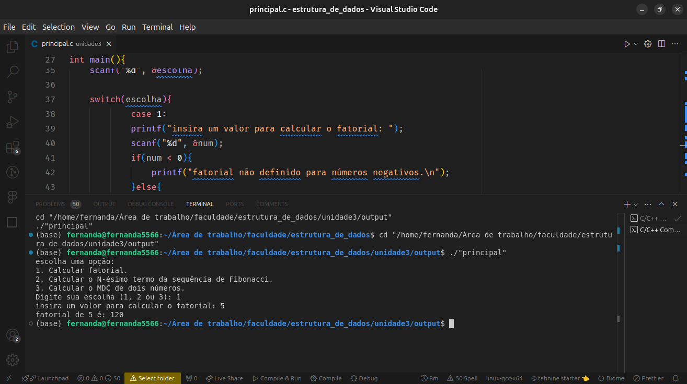
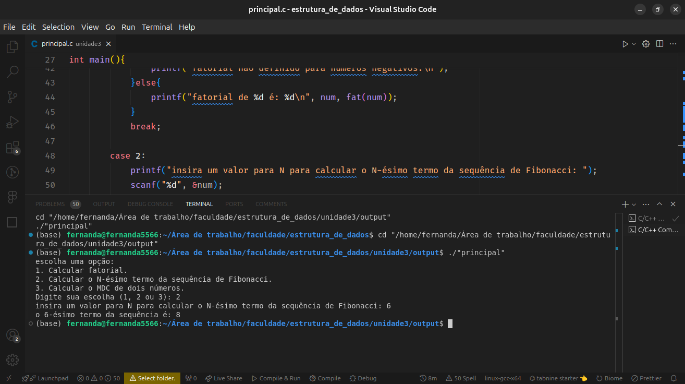
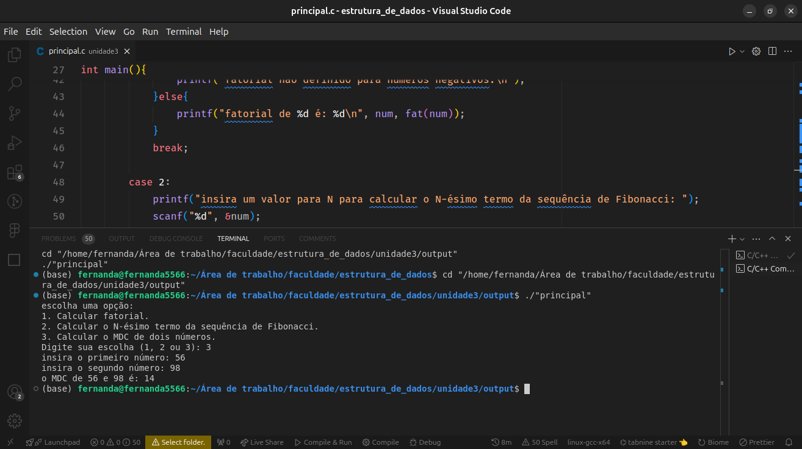

<h2 align="left">Atividade UNIDADE 3 - AVA</h2>

###

<h5 align="left">Descrição:</h5>

###

Os alunos serão desafiados a criar um programa em C que utiliza funções recursivas para resolver problemas comuns, demonstrando o uso adequado da recursão e explorando diferentes tipos de recursão.

###

<h5 align="left">Tarefas:</h5>

###

<h6 align="left">1. Implementação de Funções Recursivas:</h6>

###

- Implementar uma função recursiva para calcular o fatorial de um número.     - Implementar uma função recursiva para calcular o N-ésimo termo da sequência de Fibonacci.     - Implementar uma função recursiva para calcular o máximo divisor comum (MDC) de dois números.

###

<h6 align="left">2. Teste do Programa:</h6>

###

- No programa principal, permitir que o usuário escolha entre calcular o fatorial de um número, o N-ésimo termo da sequência de Fibonacci ou o MDC de dois números.     - Utilizar as funções recursivas implementadas para realizar os cálculos solicitados pelo usuário.     - Exibir os resultados na tela para verificar se as operações foram realizadas corretamente.

###

<h5 align="left">Resultados das operações:</h5>

###

<h6 align="left">Implementar uma função recursiva para calcular o fatorial de um número:</h6>
</img>

###

<h6 align="left">Implementar uma função recursiva para calcular o N-ésimo termo da sequência de Fibonacci:</h6>
</img>

###

<h6 align="left">Implementar uma função recursiva para calcular o máximo divisor comum (MDC) de dois números:</h6>
</img>
